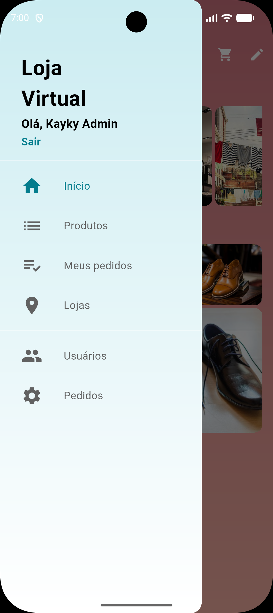
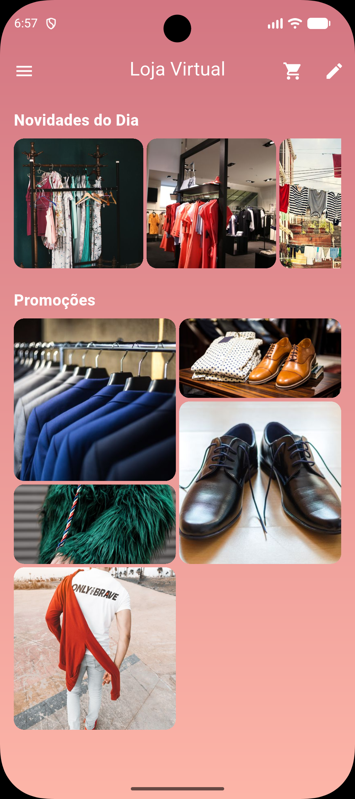
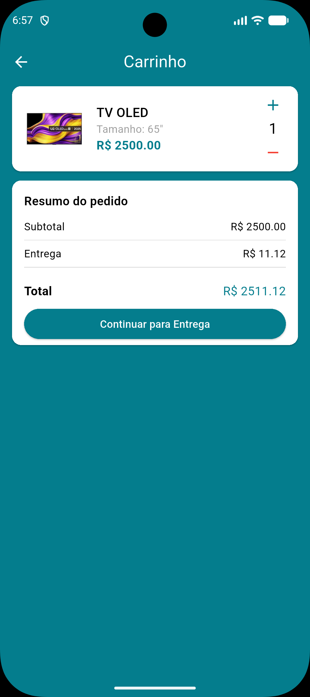
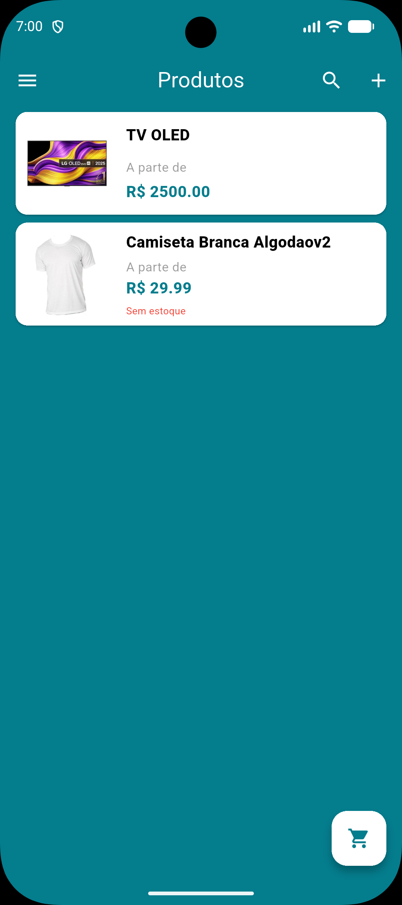
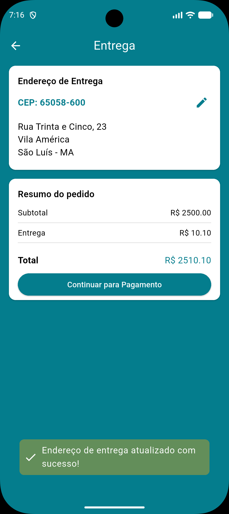

# 🛍️ Loja Virtual App

Aplicação de e-commerce desenvolvida em **Flutter** como projeto de estudo durante o curso **Crie uma Loja Virtual em Flutter**.

O projeto tem como objetivo praticar o desenvolvimento de aplicações mobile completas utilizando **Flutter** e **Firebase**, abordando autenticação, gerenciamento de produtos, carrinho de compras, recursos administrativos.

---

## 📱 Demonstração

  
  
  

  
  
  

---

## ✨ Funcionalidades

### 👤 Autenticação

- ✅ Cadastro de usuários
- ✅ Login com e-mail e senha
- ⏳ Recuperação de senha
- ⏳ Login com Facebook

### 🛍️ Loja

- ✅ Listagem de produtos
- ✅ Detalhes dos produtos
- ✅ Carrinho de compras
- ⏳ Favoritos
- ⏳ Cupons de desconto
- ⏳ Checkout
- ⏳ Pagamento

### 📦 Pedidos

- ✅ Realização de pedidos
- ✅ Histórico de pedidos

### 👨‍💼 Administração

- ✅ Recursos administrativos
- ✅ Cadastro de produtos
- ✅ Gerenciamento de produtos

---

## 🚀 Tecnologias

### Flutter

- Flutter
- Dart
- Provider
- ChangeNotifier

### Firebase

- Firebase Authentication
- Cloud Firestore
- Firebase Storage
- Firebase Cloud Functions

---

## 🔥 Firebase

O projeto utiliza os seguintes serviços do Firebase:

| Serviço         | Descrição                    |
| --------------- | ---------------------------- |
| Authentication  | Autenticação de usuários     |
| Cloud Firestore | Banco de dados               |
| Cloud Storage   | Armazenamento de imagens     |
| Cloud Functions | Regras de negócio do backend |

---

## 📚 Curso

Projeto desenvolvido durante o curso **Crie uma Loja Virtual em Flutter**.

---

## 👨‍💻 Autor

**Kayky Barbosa**

GitHub:
https://github.com/KaykyBarbosa

---

## 📄 Licença

Este projeto está licenciado sob a **Apache License 2.0**.

Copyright © 2025 Kayky Barbosa.
Consulte o arquivo `LICENSE` para mais informações.
